# System Patterns: Checkatrade Awards Nomination System

## Overall Architecture

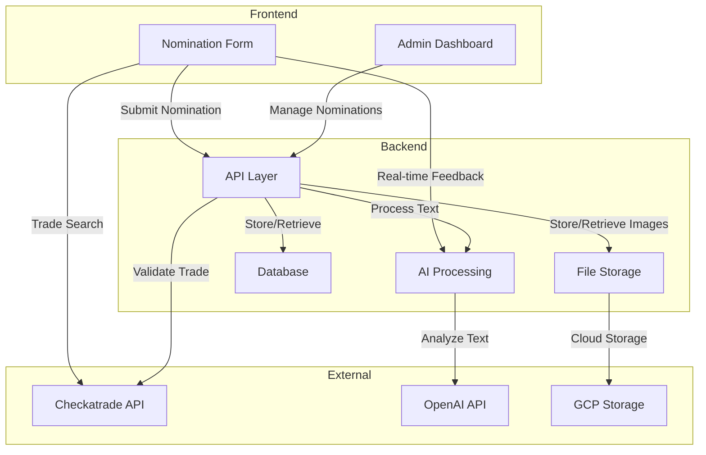

## Current Implementation Structure

### Frontend Components

#### Multi-step Nomination Form
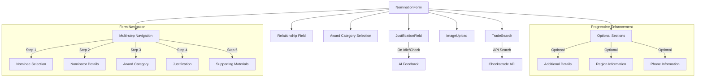

#### AI Feedback Implementation
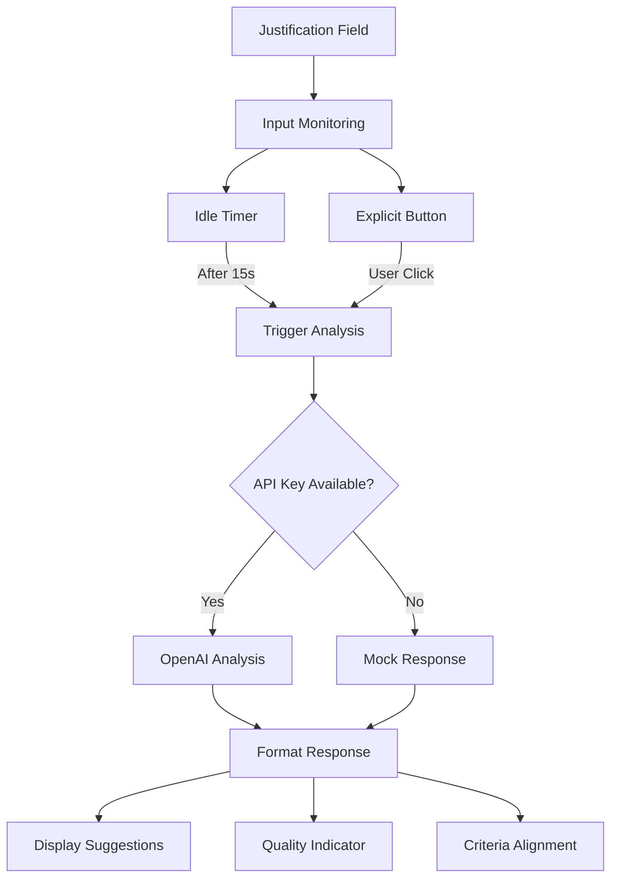

#### Form State Management
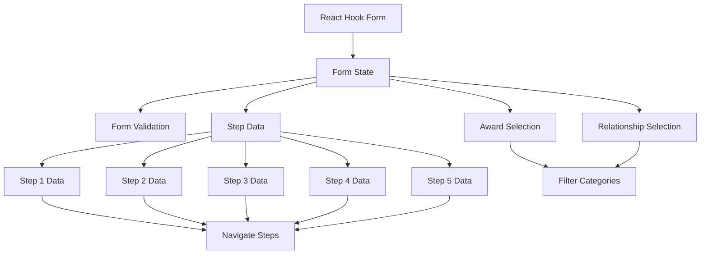

### Backend Data Model

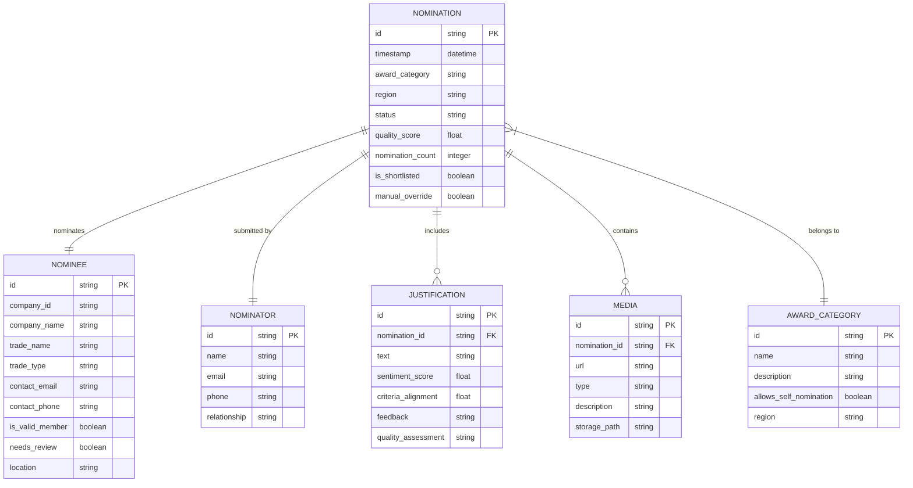

## Implemented Design Patterns

### Progressive Enhancement Pattern
- Core form with essential fields presented first
- Optional sections revealed via "Add More Details" button
- Preserves simplicity while allowing for detailed submissions
- Implemented through conditional rendering and state management

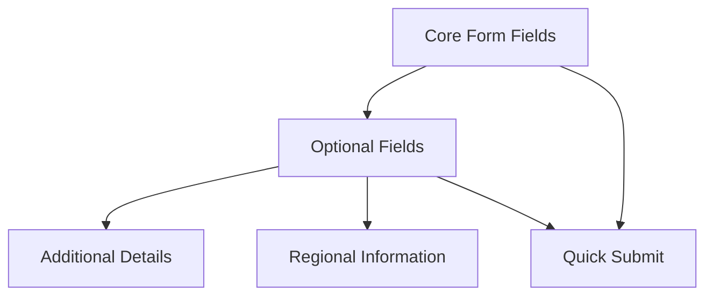

### Multi-step Form Pattern
- Form divided into logical steps to reduce cognitive load
- State preserved between steps
- Navigation controls for moving forward and backward
- Validation at each step before proceeding

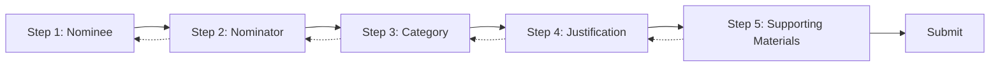

### AI Integration Pattern
- Real-time processing for immediate feedback
- Idle-detection to minimize API calls
- Explicit check option for user control
- Development mode with mock responses
- Graceful fallback for API failures

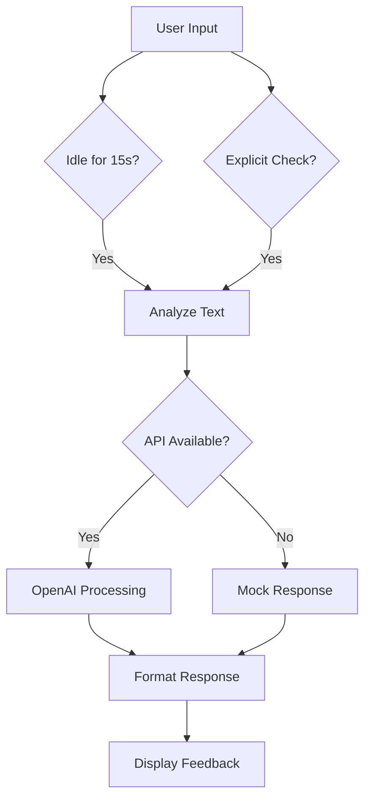

### Form Validation Pattern
- Client-side validation for immediate feedback
- Real-time field validation
- Step validation before proceeding
- Form-level validation before submission
- Implemented using React Hook Form

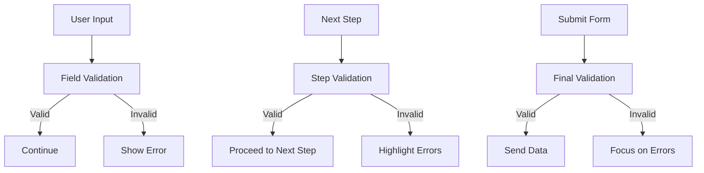

### Repository Pattern (Planned)
- Centralized data access logic
- Abstraction over database operations
- Simplified testing and maintenance
- Implementation pending backend development

### Adapter Pattern for External APIs
- Abstraction over Checkatrade API
- Consistent interface for OpenAI integration
- Error handling and retry logic
- Mock responses for development mode

## Code Quality Patterns

### ESLint Configuration
- ESLint configured with Next.js and TypeScript rules
- Max-lines rule enforced to limit files to 200 lines
- Ensures components remain focused and maintainable
- Encourages breaking down large components into smaller, reusable pieces
- Improves code readability and maintainability

### Nomination Quality Assessment
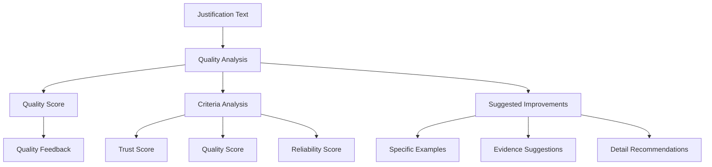

### Nomination Processing Pipeline (Planned)
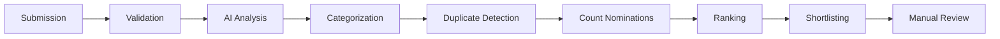

## Security Considerations (Planned)
- Input sanitization to prevent injection attacks
- Rate limiting to prevent abuse
- Data encryption for sensitive information
- Access control for administrative functions
- GDPR compliance for handling personal data
- Secure image upload and storage

## Scalability Patterns (Planned)
- Pagination for handling large nomination sets
- Caching for frequently accessed data
- Efficient filtering and sorting for admin operations
- Optimized database queries for reporting
- Load balancing for regional event scaling
